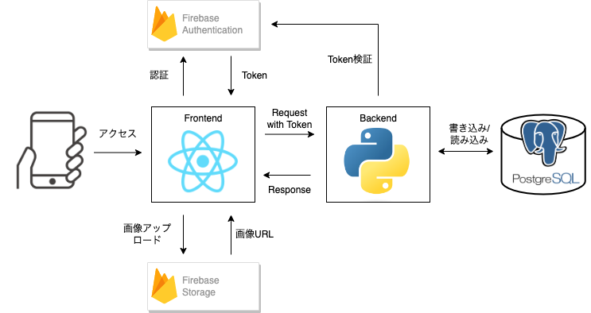

# チャンカリ

## About
__チャンカリ__  
ちゃんと借りて、ちゃんと返す。借りパク防止サービス  

## システム構成
Frontend と Backend の2つのWebアプリケーションで構成  
- Frontend: SPA (Single Page Application) 
- Backend: DB と API サーバー (WebAPIを構築)

### Feature
- Authentication
- RESTful API
- RDB
- Image file upload

### 設計ドキュメント
詳細な設計ドキュメントは [設計ドキュメント](docs/README.md) および`docs/` を参照



## Getting started
### 環境構築
frontend と backend はそれぞれ以下のディレクトで管理  
環境構築および実行方法等も各ディレクト配下の `READEME.md` を参照
- [Dockerインストール](docs/get_started/install_docker.md) (共通)
- [docs/README.md](docs/README.md#ドキュメント確認方法)
- [frontend/README.md](frontend/README.md)
- [backend/README.md](backend/README.md)

### For frontend
```sh
cd frontend
```

### For backend
```sh
cd backend
```

## Hosting
Coming soon.  
Our application will be hosted on AWS services.
