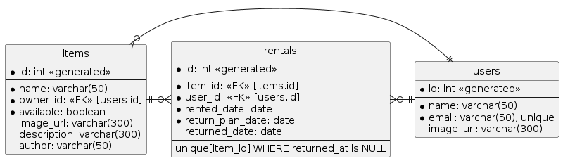
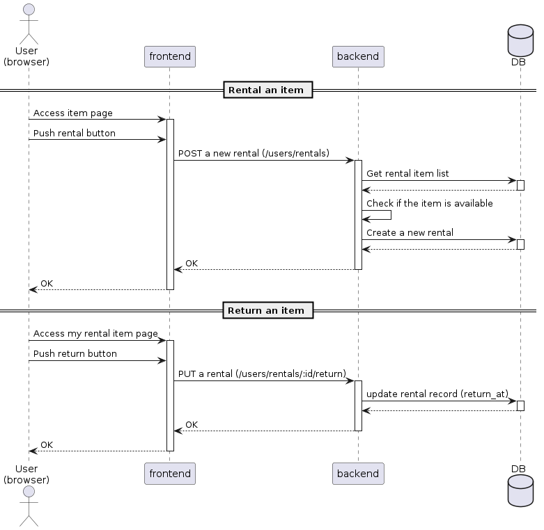

# ドキュメント確認方法
## PlantUML 起動
ER図やシーケンス図の確認時に下記を実行

起動 (UML描画前に起動)
```sh
docker run -d --rm -p 12345:8080 --name plantuml plantuml/plantuml-server
```
`*.pu`ファイルを開き、描画  
(Mac: `opt + d`, Windows: `alt + d`)

UMLの確認後にdockerコンテナを終了させる
```sh
docker stop plantuml
```

# 設計ドキュメント
## システム構成
FireBaseを使った構成とする


## ER図
レンタルのstatus管理は`returned_at`がnullかどうかで判定する。返却リクエストを受け取ると`returned_at`に日時が入力される想定である。

  
[er_diagram/er_diagram.pu](er_diagram/er_diagram.pu)

## API仕様書
https://naoyuki1115.github.io/chan-kari/  
([api/openapi.yaml](api/openapi.yaml))

## シーケンス図
### 認証フロー
FireBase Authenticationを利用してユーザー認証を実施し、`Token`を取得する。  
認証後は`Token`をheaderに付与してHTTPリクエストを投げ、Backendにて`Token`の検証を行う。  
`Token`をデコードすることでBackendはメールアドレスなどのユーザー情報を取得する。

  
[sequence/authentication.pu](sequence/authentication.pu)

### ItemのCRUDフロー(追加/取得/更新/削除)
Item画像はDB上には保存せず、FireBase Storage上に保存し、Upload先のURLをDBに保存する。  
エラー時のロールバックを考慮し、DB書き込みとFireBase書き込みのタイミングは下記とする。
- Upload時: FireBaseアップロード後にDBへレコード追加
- Delete時: DBのレコード削除後にFireBase上の画像を削除

  
[sequence/crud_process.pu](sequence/crud_item.pu)

### レンタルおよび返却フロー
レンタル時はItemが利用できるか(他のユーザーによるレンタルとコンフリクトを起こしていないかなど)を確認したのち、新規rentalのレコードを追加する。  
レンタル履歴を保持するため、返却処理はrentalレコードの`closed` フラグを立てる処理とする。DB上でrentalテーブルの`returned_at`がnullでなければ、`closed=true`として扱う

  
[sequence/rental_process.pu](sequence/rental_process.pu)
